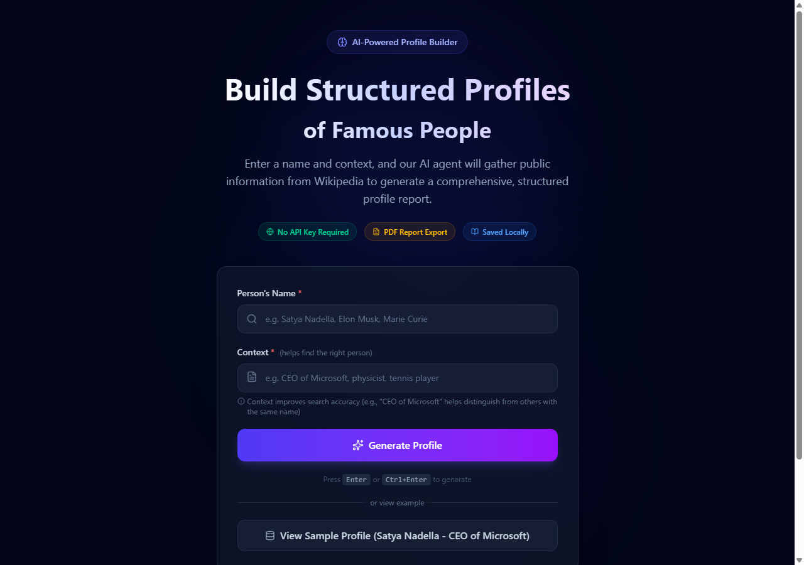

<p align="center">
  
  
  
  
  
</p>

<h1 align="center">AI-Powered Profile Builder</h1>

<p align="center">
  A web application that creates structured profiles of famous people using publicly available Wikipedia data.<br />
  <strong>No API keys or paid services required.</strong>
</p>

<p align="center">
  Built for the <strong>AI-Powered Profile Builder Internship Assignment</strong>
</p>

<br />

---

## 📸 Screenshots

<table>
  <tr>
    <td align="center" width="50%">
      <strong>Landing Page &amp; Input Form</strong><br />
      
      <br />
      <em>Clean interface to enter a person's name and context</em>
    </td>
    <td align="center" width="50%">
      <strong>Generated Profile Report</strong><br />
      
      <br />
      <em>Comprehensive profile with all extracted information</em>
    </td>
  </tr>
</table>

---

## 🚀 Quick Start

### Prerequisites

- **Node.js 18+** and **npm 9+** — [Download here](https://nodejs.org/)

### Setup

```bash
# Clone the repository
git clone https://github.com/VijayaKumarchinta/famous-person-profile-agent.git
cd famous-person-profile-agent

# Install dependencies
npm install

# Start the development server
npm run dev
```

Open **[http://localhost:5173](http://localhost:5173)** in your browser.

| Command | Description |
|---------|-------------|
| `npm run dev` | Start development server with hot reload |
| `npm run build` | Create production build in `dist/` |
| `npm run preview` | Preview the production build |

---

## 📖 How to Use

### Step-by-Step Guide

<table>
  <tr>
    <th>Step</th>
    <th>Action</th>
    <th>Example</th>
  </tr>
  <tr>
    <td align="center">1</td>
    <td>Enter the person's full name</td>
    <td><code>Satya Nadella</code></td>
  </tr>
  <tr>
    <td align="center">2</td>
    <td>Provide context for accuracy</td>
    <td><code>CEO of Microsoft</code></td>
  </tr>
  <tr>
    <td align="center">3</td>
    <td>Click <strong>Generate Profile</strong> or press <kbd>Enter</kbd> / <kbd>Ctrl</kbd>+<kbd>Enter</kbd></td>
    <td>—</td>
  </tr>
  <tr>
    <td align="center">4</td>
    <td>Export results — PDF report or JSON</td>
    <td>—</td>
  </tr>
</table>

> **Note:** If any information is not publicly available, the application clearly marks it rather than fabricating data.

### Input Guide

#### Name Field
Enter the **full name** of a famous person. Use the most commonly known version of their name for best Wikipedia search results.

| ✅ Good Inputs | ❌ Poor Inputs |
|---------------|---------------|
| `Satya Nadella` | `Satya` (too vague) |
| `Elon Musk` | `CEO` (not a name) |
| `Marie Curie` | `Microsoft guy` (not a name) |
| `Cristiano Ronaldo` | `CR7` (nickname) |

#### Context Field
Context is **required** — it helps the search find the correct Wikipedia article, especially when multiple people share the same name. Be specific about who they are or what they're known for.

| ✅ Good Context | Why It Helps |
|----------------|-------------|
| `CEO of Microsoft` | Distinguishes from other people named Satya Nadella |
| `Tesla CEO` | Finds the right Elon Musk vs. other Elon Musks |
| `physicist Nobel Prize` | Narrows to the famous scientist |
| `Indian independence leader` | Finds Mahatma Gandhi vs. other Gandhis |

#### Why Context Matters

Without context, the search might return the wrong person or a disambiguation page. For example:

| Name | Without Context | With Context (`CEO of Microsoft`) |
|------|----------------|-----------------------------------|
| `Michael Jordan` | ⚠️ Could return the professor or the basketball player | ✅ Michael Jordan (basketball) — if context is "basketball player" |
| `Satya Nadella` | ⚠️ May not prioritize the correct page | ✅ Satya Nadella (Microsoft CEO) |

### Sample Profile

Click **"View Sample Profile"** on the landing page to see a pre-generated profile for **Satya Nadella (CEO of Microsoft)**, which matches the assignment's example input exactly.

---

## 📋 Generated Profile Sections

| # | Section | Description |
|:---:|---------|-------------|
| 1 | **Executive Summary** | 2-3 sentence overview from Wikipedia |
| 2 | **Full Name** | Extracted from infobox or article |
| 3 | **Nationality** | Pattern matching from text |
| 4 | **Current Role** | Extracted from infobox / Wikipedia |
| 5 | **Industry** | Keyword-based detection |
| 6 | **Current City / Country** | From infobox residence data |
| 7 | **Biography** | Wikipedia article summary |
| 8 | **Career Timeline** | Year-based event extraction |
| 9 | **Education** | Infobox + text pattern matching |
| 10 | **Interests** | Keyword and hobby detection |
| 11 | **Net Worth** | Financial pattern extraction |
| 12 | **Recent News** | Recent year mentions in article |
| 13 | **References** | Source links (Wikipedia, etc.) |

---

## 🏗️ Architecture

```
┌──────────────────────────────────────────────────────────────┐
│                 User Input (Name + Context)                   │
└───────────────────────┬──────────────────────────────────────┘
                        │
                        ▼
┌──────────────────────────────────────────────────────────────┐
│                    Wikipedia Service                          │
│                                                              │
│  ┌──────────────┐   ┌──────────────┐   ┌────────────────┐   │
│  │  OpenSearch  │ → │ REST Summary │ → │  Action API    │   │
│  │  (Find Page) │   │  (Extract)   │   │  (Full Text)   │   │
│  └──────────────┘   └──────────────┘   └────────────────┘   │
│                                        ┌────────────────┐   │
│                                        │  Infobox Parser│   │
│                                        └────────────────┘   │
└───────────────────────┬──────────────────────────────────────┘
                        │
                        ▼
┌──────────────────────────────────────────────────────────────┐
│                   Profile Extractor                           │
│                                                              │
│   Pattern Matching & Heuristics to extract structured data:  │
│   • Career timeline    • Education        • Net worth        │
│   • Interests          • Recent news      • Basic details    │
│   • Biography          • References                           │
└───────────────────────┬──────────────────────────────────────┘
                        │
                        ▼
┌──────────────────────────────────────────────────────────────┐
│              Profile Display + PDF/JSON Export                │
│              (React UI + jsPDF + JSON download)              │
└──────────────────────────────────────────────────────────────┘
```

---

## 🛠️ Tech Stack

| Category | Technology | Purpose |
|----------|-----------|---------|
| **Frontend** | React 19 + TypeScript | UI framework and application logic |
| **Styling** | Tailwind CSS 4 | Modern, responsive design |
| **Build Tool** | Vite 7 | Fast development and optimized builds |
| **Icons** | Lucide React | Consistent icon library |
| **PDF Generation** | jsPDF | Client-side PDF creation (single A4 page) |
| **Data Source** | Wikipedia API | Public information — no authentication required |

> All tools are **free and open-source**. No paid APIs or AI services are used.

---

## 🔒 Data & Privacy

| Feature | Detail |
|---------|--------|
| **Storage** | Browser localStorage (no server) |
| **Data Retention** | Up to 10 profiles in history |
| **Exports** | PDF and JSON — saved to your Downloads folder |
| **Tracking** | None — no analytics, no data collection |
| **API Keys** | Not required — uses public Wikipedia APIs only |

---

## ✅ Assignment Compliance

| Requirement | Status | Implementation |
|-------------|:------:|----------------|
| Accept name as input | ✅ | Required text field with validation |
| Accept context as input | ✅ | Required text field with validation |
| Gather public information | ✅ | Wikipedia API (OpenSearch + REST + Action) |
| Generate structured profile | ✅ | All 13 required sections extracted |
| Mark unavailable info clearly | ✅ | "Information not publicly available" |
| No paid AI tools or APIs | ✅ | Pattern matching and heuristics only |
| PDF downloadable report | ✅ | Single A4 page via jsPDF |
| GitHub repository | ✅ | Public repository |
| README with setup steps + screenshots | ✅ | Complete documentation |
| Sample profile included | ✅ | Satya Nadella pre-loaded |

---

## 📝 License

This project is licensed under the **MIT License**. See the [LICENSE](LICENSE) file for details.

---

<p align="center">
  Built for the <strong>AI-Powered Profile Builder Internship Assignment</strong>
</p>
